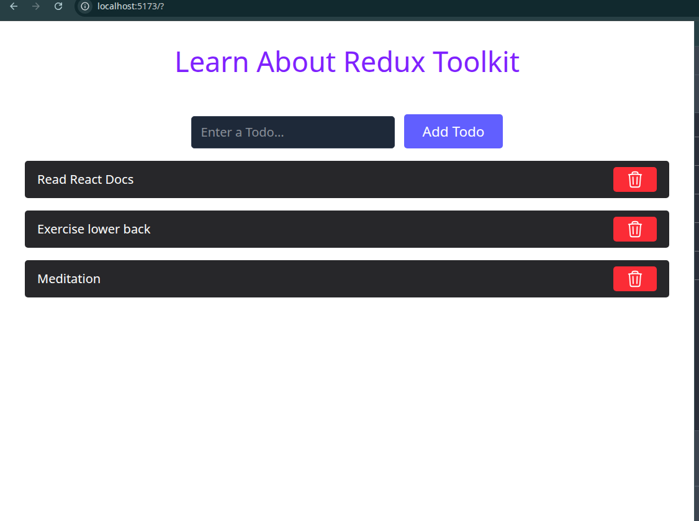
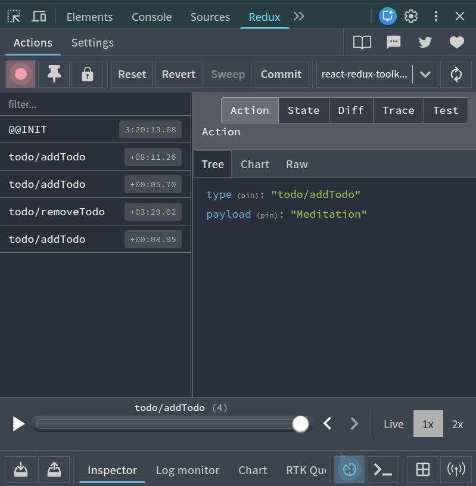

# React Redux Toolkit Todo ⚛️

A robust Task Management application built with React and Tailwind CSS. This project serves as a comprehensive guide to modern **Global State Management**, utilizing Redux Toolkit (RTK) to architect a scalable and predictable state container, replacing traditional Context API patterns.

## 🚀 Features

- **Full CRUD Operations:**
  - **Create:** Add new tasks generated with unique IDs.
  - **Read:** View all tasks seamlessly mapped from the global store.
  - **Update:** Edit existing task text directly within the state tree.
  - **Delete:** Remove tasks instantly using targeted action payloads.
- **Centralized State:** Manages the entire application's data flow through a single, secure Global Store.
- **Predictable Mutations:** Leverages RTK's built-in Immer library to safely write "mutating" logic that automatically produces immutable state updates.
- **Scalable Architecture:** Organizes logic using the modern "Slice" pattern, keeping actions and reducers tightly coupled and highly readable.

## 🛠️ Tech Stack

- **Library:** React JS
- **State Management:** Redux Toolkit (`@reduxjs/toolkit`) & React-Redux
- **Styling:** Tailwind CSS
- **Build Tool:** Vite

## 🧠 Concepts & Hooks Used

This project was built to master the Redux data flow and the integration between React components and the Redux Store. Here is how the core concepts are applied:

- **`configureStore`**: Used to quickly set up the centralized Redux store, automatically enabling Redux DevTools and integrating standard middleware.
- **`createSlice`**: Defines the "Todo" feature section. It bundles the `initialState`, the specific `reducers` (logic), and automatically generates the corresponding action creators.
- **`useSelector`**: The bridge for reading data. Used within components to subscribe to the store and extract specific pieces of state (e.g., `state => state.todos`).
- **`useDispatch`**: The command center. Used to fire off actions (like `addTodo(text)`) from the React UI to the Redux reducers.
- **`action.payload`**: Utilized inside reducers to unpack the data sent from the components (whether a single primitive ID or a complex object).
- **Immer Integration**: Applied inside reducers to write simple, highly readable mutation syntax (e.g., `state.todos.push(todo)`) instead of complex spread operators.
- **`nanoid`**: A utility function from Redux Toolkit used to easily generate non-cryptographic, unique string IDs for new tasks.

## 🖥️ Screenshots

**Active Tasks View**


**Redux DevTools Flow**


## 💻 How to Run Locally

1. **Clone the repository**
   ```bash
   git clone [https://github.com/umersaif11/react-redux-toolkit-todo.git](https://github.com/umersaif11/react-redux-toolkit-todo.git)
   ```

2. Navigate to the project directory
```bash
   cd react-redux-toolkit-todo
```    
3. Start the development server
```bash
   npm run dev
```  
   